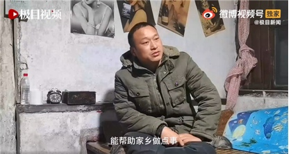
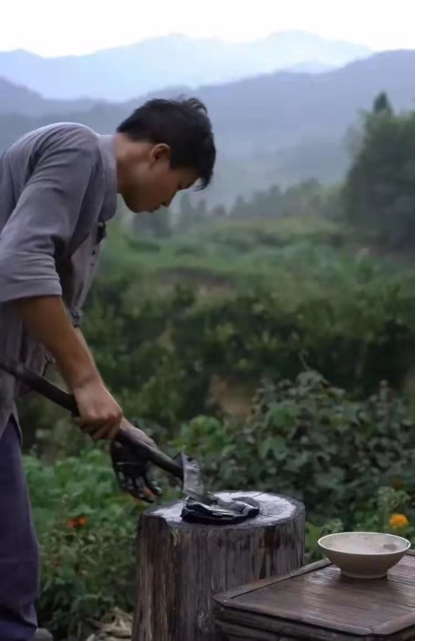
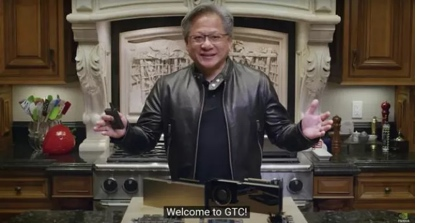

#抖音都能孵化张同学和彭传明，Web3凭什么不行？

张同学开始直播带货了，彭传明也有900万粉丝了，如果还有朋友不知道这俩人，那可能你要去抖音上好好研究下了，因为这俩人预示着抖音的趋势，甚至是Web3的趋势！

张同学主要拍新农村生活，简简单单，脏脏乱乱却又非常诙谐。他每个视频都配上了德语经典老歌《Aloha Heja He》，节奏感很强，而且处处透露着黑色幽默。
 

最强悍的是——他用了2个多月的时间就拥有了超过1200万粉丝。创造了抖音的历史。 1200万这个数字什么概念呢？欧盟如此强大，但里面甚至一半国家人口都没有1000万。

张同学和彭传明的视频都非常写实，很真实很自然，就像我小时候在老家的时候，我就直接去水缸里用瓢去盛水。还有里面北方的常见灶台，猪油炒菜啊包饺子啊啥的。

这些画面让我干到亲切且真实。

张同学和彭传明的视频并不会刻意搞笑，甚至没有其他土味儿视频里的常见罐头笑声，却特别诙谐幽默，让人看起来倍感舒服、亲切、自然。

吃的不是什么山珍海味，但又不是什么野菜稀饭，但里面传递出的乡土情结，传递出的真实感觉，触动的是无数中国人内心深处最柔软的地方。
 

人们都说，抖音是上海的节奏，小资、美好、靓丽。但是张同学和彭传明的出现，却让抖音里多了一股真实的清流。我很怀疑，张同学和彭传明之于抖音的关系，恐怕就是Sandbox之于Binance。大概就是内部亲自孵化的IP。

抖音最开始的定位是 “专注于年轻人的15秒音乐短视频社区”。搞定了年轻人之后，抖音就变成了“记录美好生活”的抖音。毕竟农村生活可能是中国乃至大多数发展中国家的最重要的场景。

抖音有这样的格局，也是可喜可贺。

但是web3里面呢？

创造一些雅俗共赏的东西，应该会越来越成为互联网公司趋势，它既是时代要求的使命，又是业绩增长的任务。

但是很遗憾，即今为止，我反而还没太真正看到Web3公司有这样的格局和雄心。最近看到的几个Web3项目，都在执着于匪夷所思的东西。

比如某M开头的社交平台，号称Web3基础设施，主打的功能却是可以展示自己NFT的推特，同时注册还要弄一艘游艇。

平台不让讲中文就已经很令人反感了，然后展示NFT算哪门子的Web3？

游艇也许是Degen文化的一部分，但是十万个群众里能有几个degen呢？这完全有一种Web3时代“何不食肉糜”的感觉。
 

千言万语化作几个字：Web3就这？

Web3能改变网络生活的经济形态，自然也能去影响和催生新的组织模式。但是目前，似乎并没有一种很好的组织模式诞生。

现在推动Web3向前发展的，大部分是资本的力量。

一个经常出现的名字是a16z，中文名安德森•霍洛维茨基金（Andreessen Horowitz）。这家来自硅谷的风投，一向被认为是Web3浪潮中的先锋力量，无聊猿公司Yuga Labs和全球最大的NFT交易平台OpenSea，就是由a16z投资的。

但是资本的格局，还要再放大一点，几个人凑一起玩玩NFT，弄个展示或炫耀的工具，就不要吹自己是Web3了。

现在的Web3项目，通病是含梦率太高，格局却不足。

但是任何时代，在早期都是劣币驱逐良币，泡沫破灭之后，才知道谁能真正撑得起来。
 

“炒币”时代已经结束，落地应用的时代已经开始。目前我们能看到最接近实现这一愿景的领域正是 Web3.0。

尽管 Web3 现有发展程度，还远不足以「接棒」 我们现今所处的 Web2.0 世界。

但我相信，终有一天，星辰和大海会一起来，我们也会拥有我们的“张同学和彭传明”，拥有真正落地的Web3，真正代表大众的Web3，真正让我们拥有美好生活的Web3。
